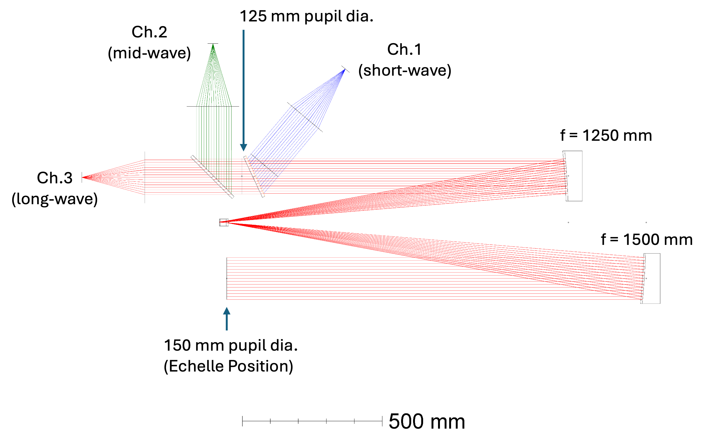
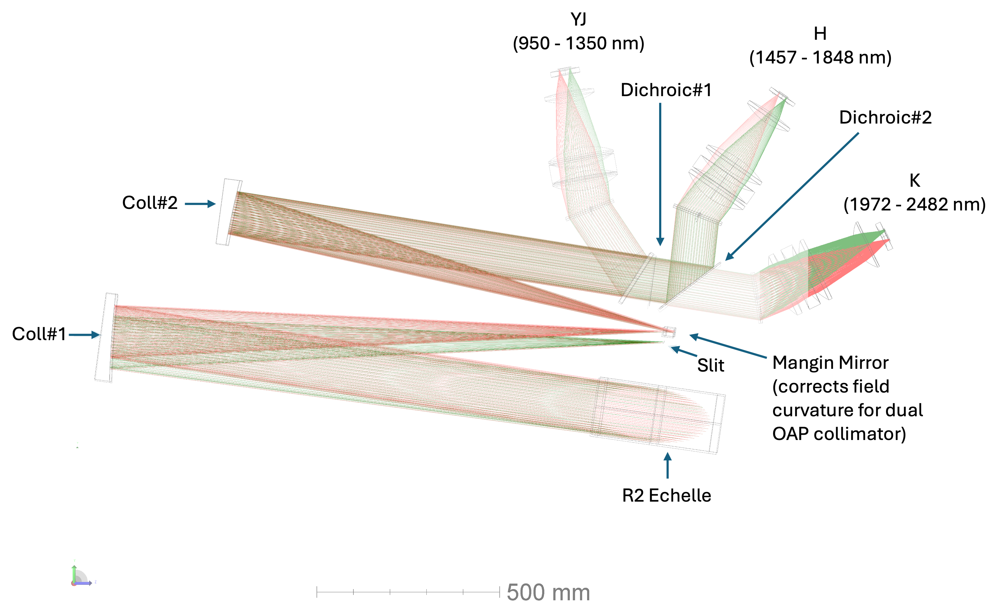
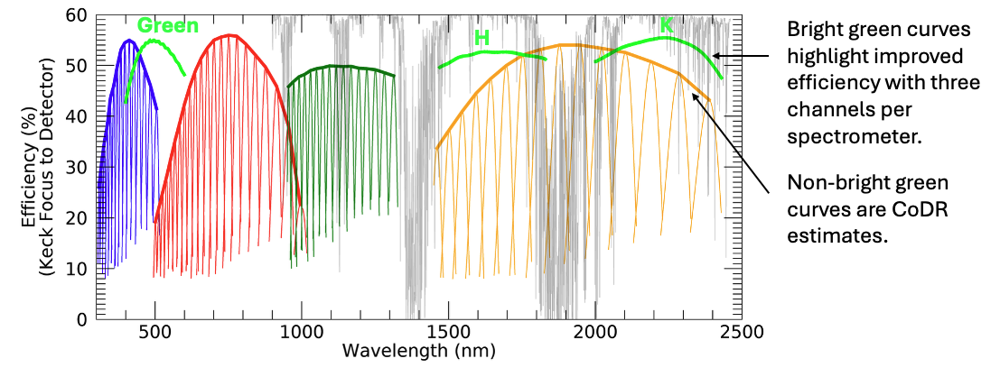

ZSpec
=====

ZSpec' optical design is being driven by a deliberately broad instrument
role: rapid low-resolution transient classification after binning, medium/high-resolution stellar and circumstellar
velocity work, high-S/N blue abundance work, and NIR coverage for reddened or high-redshift sources.

.. container:: zs-note-to-team zs-internal-only

   **Figure placeholders**

   - Updated Zemax optical layout for the IR spectrometer, slit to detector.
   - Updated Zemax optical layout for the visible spectrometer.
   - YJ/H/K spectral-format figure with 10 arcsec slit.
   - Blue/Green/Red spectral-format figure once the visible design is complete.
   - Efficiency comparison: CoDR channel split versus post-CoDR six-channel split.
   - Spot/EE80 maps and line-spread-function maps at representative wavelengths.

The Design and Its Requirements
-------------------------------

The top-level spectroscopic problem (c.f. :doc:`Requirements <requirements>`): cover 0.31–2.45 µm,
Nyquist sample the delivered image, support a 10" long slit, deliver high (~20k-40k) resolving power, and
retain faint-object sensitivity after binning to R≈1000.  Operational needs (c.f. :doc:`OCDD <documents_tools>`) add low
overheads, repeatable configuration, fast ToO response, and stable calibrations.

ZSpec addresses these constraints through a fixed spectral format and a high native resolving power.  The full coverage
fixed format minimizes the need for both recalibration and configuration trades during a transient response: the
observer need focus mostly on exposure time (S/N), slit width (R), and science sequence rather than grating/camera
combinations. The high native resolving power is important as several science cases need R≈10,000–20,000+ natively, while
low-resolution transient programs can be synthesized later by binning the same spectra after sky-line rejection and
variance-aware extraction. Moreover the use of  low/zero-noise :doc:`detector technologies <detector_technologies>` is
expected to further mitigate the noise penalty from high binning factors.

Working Design Point and Spectrometer Split
-------------------------------------------

Architecture Update Since CoDR
~~~~~~~~~~~~~~~~~~~~~~~~~~~~~~

The CoDR design used three spectrometers and several image plane detector mosaics. Post-CoDR, the design responds
directly to reviewer concern about large anamorphic factors, echelle/detector mosaics, and other suggestions.
The present design direction makes four coupled changes:

- Increase the echelle pupil from 125 mm to 150 mm.
- Reduce the echelle R-number from R3 to R2.
- Format every science channel onto a single 2k × 2k active detector area.
- Reduce the instrument from three spectrometers to two spectrometers, each split into three channels with their own cross-disperser.

This moves the natural-seeing design point to from R≈20,000 to R≈18,000 with a 0.7 arcsec slit, though with significantly
less spread due to decreased anamorphism, spanning only 17,000–21,000 across the echellogram.  The largest-order
anamorphic range is reduced from roughly ±30% to roughly ±10%.  The same change removes the need for a detector mosaic
in the IR and makes the active detector format largely agnostic to detector technology increasing resilience should
LmAPDs fail to materialize.

.. container:: zs-note-to-team zs-internal-only

   The R≈18,000 design point is the one place where the post-CoDR optical update is most visibly in tension with the
   SRD wording. We need to fully capture that R≥18,000 is slit/AO/slicer dependent.

.. list-table::
   :header-rows: 1
   :widths: 30 70

   * - Item
     - Working value / design intent
   * - Spectrometer count
     - Two: one visible, one infrared.
   * - Science channel count
     - Six total: Blue, Green, Red, YJ, H, K.
   * - Wavelength span
     - Approximately 308–2482 nm in current channel definitions.
   * - Slit length
     - 10" shown in current spectral-format figures; longer slit length may become available if cross dispersion is regularized.
   * - Natural-seeing resolving power
     - Approximately R=17,000–21,000 with a 0.7 arcsec slit; median R≈18,000.
   * - Higher-resolution route
     - Narrower slit with AO seeing enhancement or t'put loss and/or a possible lossless natural-seeing slicer mode.
   * - Echelle
     - R2 design, 150 mm pupil, sized to the current practical monolithic grating limit.
   * - Detector active area
     - 2k × 2k per channel, 15 µm pixels.
   * - Anamorphic range
     - Roughly ±10% across the order with the largest free spectral range.
   * - Channel architecture
     - Dichroic split to three channels per spectrometer; channel-optimized cross-dispersers and cameras.
   * - Calibration implication
     - Fixed format allows stable nightly/daytime calibration libraries, with per-configuration checks tied mainly to slit, thermal state, and drift requirements.

Spectrometer Split
------------------

.. list-table::
   :header-rows: 1
   :widths: 16 18 20 20 26

   * - Spectrometer
     - Channel
     - Approx. passband
     - Detector format
     - Notes
   * - Visible
     - Blue
     - 310–420 nm
     - 2k × 2k active area
     - Partially isolates the region with the most difficult coatings, glass transmission, and detector QE.
   * - Visible
     - Green
     - 400–600 nm
     - 2k × 2k active area
     - Improves efficiency through the optical region where the former broad visible channels were rolling off.
   * - Visible
     - Red
     - 580–980 nm
     - 2k × 2k active area
     - Carries the red optical diagnostics and bridges toward the YJ channel without forcing one detector/coating solution.
   * - Infrared
     - YJ
     - 950–1350 nm
     - 2k × 2k active area
     - 24 echelle orders in the current IR format. Avoids an IR detector mosaic and partially isolates the lowest-background NIR range.
   * - Infrared
     - H
     - 1457–1848 nm
     - 2k × 2k active area
     - 11 echelle orders in the current IR format. Improves the efficiency balance relative to the conceptual design's YJ/HK split.
   * - Infrared
     - K
     - 1972–2482 nm
     - 2k × 2k active area
     - 8 echelle orders in the current IR format. Partially isolates the thermal-background-sensitive portion of the design in one channel.

The visible and infrared spectrometer layouts are expected to follow each other: the same collimator approach, a
three-channel dichroic split, and channel-optimized cross dispersion and cameras.  The current visible calculation
indicates broadly comparable total order-separation budgets for the Blue, Green, and Red channels, but the full
visible Zemax prescription remains to be finalized.

Optical Train
-------------

Pre-optics and Slit Plane
~~~~~~~~~~~~~~~~~~~~~~~~~

The pre-optics translate divide the visible and infrared paths, reduces the K1 focal ratio from F/14 to F/10, and
provide a natural location for ADC, pupil management, field rotation, slit viewing, internal nodding.  The updated
two-spectrometer architecture is attractive here because it reduces the number of independent
science slits and all of the aforementioned supporting accouterments from three to two.  This will simplify
acquisition, slit-viewing, co-alignment, and calibration validity. In the visible channel the pre-optics also present a
natural place to incorporate a possible R≈48,000 pupil slicer upgrade.

.. container:: zs-note-to-team zs-internal-only

   Insert figure of preoptics. Order is [potential visible slicer], ADC, pupil rotator in ir, field rotator, nodder, slit &camera

Nodding and Shutters
~~~~~~~~~~~~~~~~~~~~

NIR sky subtraction generally requires a nodding strategy.  Although telescope nodding is operationally simple it moves
all channels together; an internal NIR nod can preserve optical stability, ToO efficiency, and decouple visible and
infrared exposure times.  It also offer a simple way to implement the fine guiding corrections that are anticipaded with
AO-enhanced seeing. The leading internal concept is to tip/tilt a final relay element.  This is likely acceptable if
the spectrometer sees negligible pupil motion and the slit remains telecentric enough, but that is still to be confirmed
by ray trace.

A shutter is planned placed as early as practical, especially in the IR path, to block the detectors during readout,
suppress background, and support dark calibration frames.

Collimator
~~~~~~~~~~

The spectrometer follows an asymmetric white-pupil design with a 150 mm pupil at the echelle and a smaller downstream
pupil feeding the channel cross-dispersers/cameras.  The two focal lengths shown for the asymmetric collimator are
:zs-check:`1500` mm and :zs-check:`1250` mm.  This keeps the camera aperture from growing with the larger echelle
pupil and is consistent with the broader white-pupil design principle: put the primary disperser at a pupil and reimage
the pupil near the camera/cross-disperser interface.

   ZSpec infrared collimator layout.

The collimator choice remains one of the cleanest parts of the design.  It is a known high-resolution spectrograph
architecture, it naturally separates the echelle and cross-disperser pupil planes, and it leaves the cameras as
channel-optimized but conceptually repeatable designs.

Echelle
~~~~~~~

The echelle is now an R2 grating sized around the maximum monolithic ruled area presently available from Canon.
Moving from R3 to R2 reduces anamorphic magnification and image-quality stress, while the larger 150 mm pupil recovers
much of the resolving-power loss.  This is a good example of the present design philosophy: give up a small amount of
nominal resolution to remove larger risks in detector format, grating format, and PSF variation across orders.

   ZSpec infrared spectrograph layout.

The grating will be evaluated against three different quantities: diffraction efficiency, surface
scatter, and available ruled area at the required substrate/coating/cryogenic state.  For ZShooter, scatter is not a
secondary issue because sky-line scatter and off-order light feed directly into faint-object performance.

Cross Dispersion and Dichroics
~~~~~~~~~~~~~~~~~~~~~~~~~~~~~~

Both the visible and IR spectrometers use a three-channel split post echelle.  This improves channel
efficiency relative to the previous broader split and reduces the burden on any one cross-disperser.  The current IR design
splits YJ, H, and K with dichroics after the echelle/white-pupil relay.  The visible design is expected be nearly
identical.

A prism-assisted cross-disperser remains an important trade.  Its purpose would be to make order spacing more uniform
and potentially increase usable slit length or enable a natural-seeing pupil-slicer mode.  The trade is not just
throughput.  It includes order separation, camera pupil relief, polarization, ghosts, cryogenic feasibility for the
IR, and the improves the level of design commonality (lowers-cost) retained across channels.

Cameras
~~~~~~~

The CoDR camera direction was a fast Petzval-family refractive design, with channel-specific prescriptions and a
common design approach.  The post-CoDR move to 2k × 2k active detector areas reduces required field size
relative to the 4k-wide format and therefore reduces camera stress.  Camera focal length can be re-optimized if final
detector pixel size is 10, 15, or 18 µm without requiring a full redesign of the spectrometer architecture.

The cameras remain designed as spectrograph cameras rather than general imaging cameras as they do not need to
be corrected for lateral color in the same way an imager would, because each detector position is interpreted
spectroscopically through the wavelength solution.  What matters is encircled energy relative to the narrowest useful
slit image (~2 pixels), stability of the line spread function, low ghosts, good pupil behavior, and manufacturable AR
coatings across each channel.

Sampling, Image Quality, and Resolution
---------------------------------------

The design is evaluated against both the line-spread function and the geometric spot size.  The optical PSF
must remain small enough that the slit image, not uncorrected optical aberration, sets the spectral resolution over
the science field and wavelength range.  In practice that means the 80% encircled-energy diameter should remain
comfortably below the projected width of the narrowest routine slit, with margin for alignment, thermal, and guiding effects.

The post-CoDR reduction in anamorphic range should make this problem better conditioned.  The older broad format
imposed large order-dependent changes in effective beam geometry; the new 2k-wide dispersion direction cuts this down.
The team will still verify the worst case at the blue edge of each order, where anamorphic magnification and
camera field generally combine most unfavorably.

Throughput and Stray Light
--------------------------

ZSpec throughput is designed around channel-specific optimization: dichroic splits, VPH or grism cross-dispersers,
high-efficiency echelles, AR coatings, and low-reflectivity detector surfaces, and tapered coatings on visible channel
detectors.  Peak efficiency is not the only performance metric.  For faint transient and high-redshift programs,
sky-line scatter, thermal background, ghosts, and broad-band stray light can matter as much as raw signal throughput.

The post-CoDR three-channel-per-spectrometer split should improve the efficiency balance, particularly in Green, H,
and K, by avoiding broad channels where the cross-disperser efficiency is forced to serve too much wavelength range.

   Approximate ZSpec efficiency estimates exclusive of tapered coatings.

AO and Slicer Compatibility
---------------------------

ZSpec is not dependent on AO for first light, but it is designed to benefit strongly from seeing enhancement.  With
AO, narrower slits can recover higher resolving power with less light loss than in natural seeing.  A separate
natural-seeing pupil slicer is under consideration for the visible spectrograph as a way to reach roughly R≈48,000 for
point/integrated sources without waiting for AO.  This would be a module in the pre-optics that can be inserted ahead
of the slit.

The slicer trade is attractive though is treated as an enhancement.  It adds alignment complexity,
calibration states, and data-reduction complexity. Its strongest justification is if enables a clean high-resolution
stellar/absorber mode.

.. container:: zs-note-to-team zs-internal-only

   **TODO Figure!!!**

Calibration and AIT Implications
--------------------------------

The fixed-format design is favorable for calibration, but only if the mechanisms that define slit position, field
rotation, pupil stop position, and detector focus are repeatable enough.  The AIT plan will verify wavelength
solution stability, slit selector repeatability, ZFront calibration coupling, cross-channel co-alignment, and
line-spread function stability as optical requirements, not only as software or operations requirements.

Important AIT products are expected to include:

- A per-channel wavelength map and format map tied to the final Zemax prescription.
- A line-spread function model versus wavelength, field/slit position, and slit width.
- A ghost and stray-light map from internal lamps and bright-line source tests.
- A calibration-beam uniformity map at the slit and at the detectors.
- A focus and thermal sensitivity matrix for PSFs (cameras, collimator) and detector performance.
- A mechanism repeatability model that tells helps inform when calibrations remain valid.

Open Design Trades
------------------

.. container:: zs-note-to-team zs-internal-only

   **Trades requiring optical-engineering disposition**

   - R≈18,000 versus L1 R≥20,000: formally capture that the R2/150 mm design is accepted, and that the L1 requirement
     is restated as a slit-dependent value.
   - NIR nodding implementation: decide between tip/tilt in the relay, a pupil/field steering element, or another
     internal mechanism.  Include pupil motion at the echelle, telecentricity at the slit, added
     surfaces, settling time, and stray-light consequences.

   - Prism-assisted cross dispersion: evaluate whether a grism or double-pass prism should be included to regularize
     order spacing and enable longer slits or a future slicer mode.

   - Pre-optics mechanism order: freeze the order of ADC, field derotator, pupil/stop, slit viewer, shutter, and possible slicer once chief-ray and pupil behavior are traced.
   - Cross-disperser choice: evaluate VPH-only, grism, and double-pass-prism options for order spacing, throughput, polarization, ghosts, and manufacturability.
   - Slit length: determine whether the post-CoDR format permits longer than 10 arcsec after cross-disperser optimization and whether that matters enough to change requirements.
   - Visible design maturity: produce the full visible Zemax prescription and confirm that the same two-collimator/asymmetric white-pupil approach works without hidden blue-throughput or camera-field penalties.
   - Camera glass and coatings: confirm material choices for Blue throughput below 350 nm, Red fringing/scatter implications, and IR cryogenic behavior.
   - Shutter placement: decide shutters are placed

External Technical Context
--------------------------

The ZSpec design sits in a known family of broad-band echelle spectrographs.
`X-shooter <https://www.aanda.org/articles/aa/abs/2011/12/aa17752-11/aa17752-11.html>`_ is the closest operational
analogue in science role: broad simultaneous coverage, dichroic splitting, and fixed-format echelle spectroscopy.
The ZSpec white-pupil collimator direction follows the classical astronomical echelle literature
from `Schroeder <https://ui.adsabs.harvard.edu/abs/1970PASP...82.1253S/abstract>`_ and the asymmetric white-pupil
formalism of `Gratton et al. <https://opg.optica.org/abstract.cfm?uri=ao-39-16-2614>`_.  The cross-disperser approach
should be reviewed against the astronomical VPH grating literature, including
`Barden et al. <https://www.spiedigitallibrary.org/conference-proceedings-of-spie/3355/1/Volume-phase-holographic-gratings-and-their-potential-for-astronomical-applications/10.1117/12.316806.full>`_,
and against Keck/Caltech VPH implementation experience in `KCWI <https://arxiv.org/abs/1807.10356>`_.  Echelle
procurement and scatter assumptions should be checked against modern machined-grating work such as `Sukegawa et al. <https://www.spiedigitallibrary.org/conference-proceedings-of-spie/10706/107063L/Commercial-availability-of-astronomical-machined-gratings-by-Canon/10.1117/12.2314184.short>`_.
